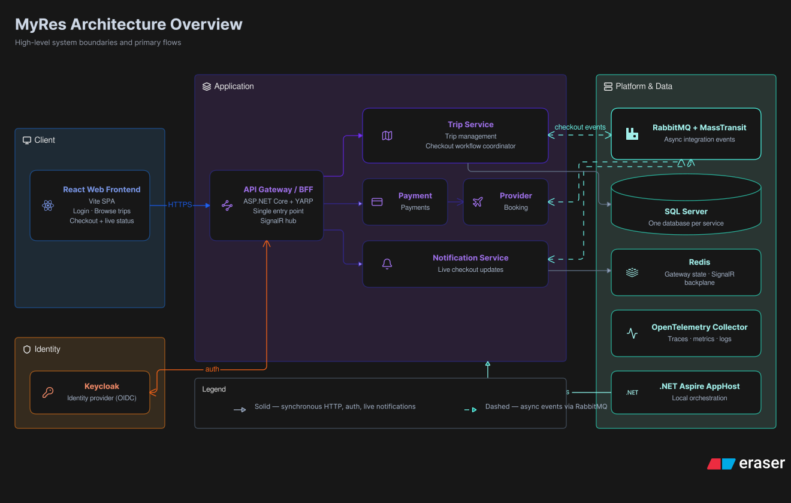
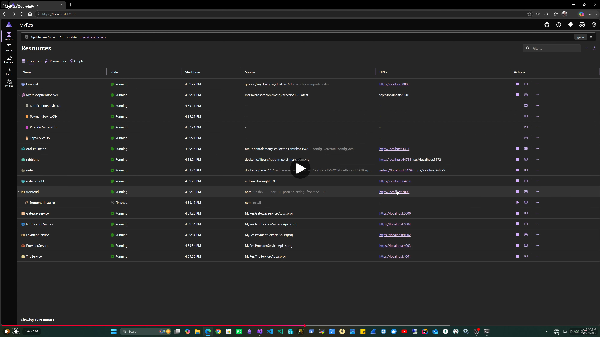
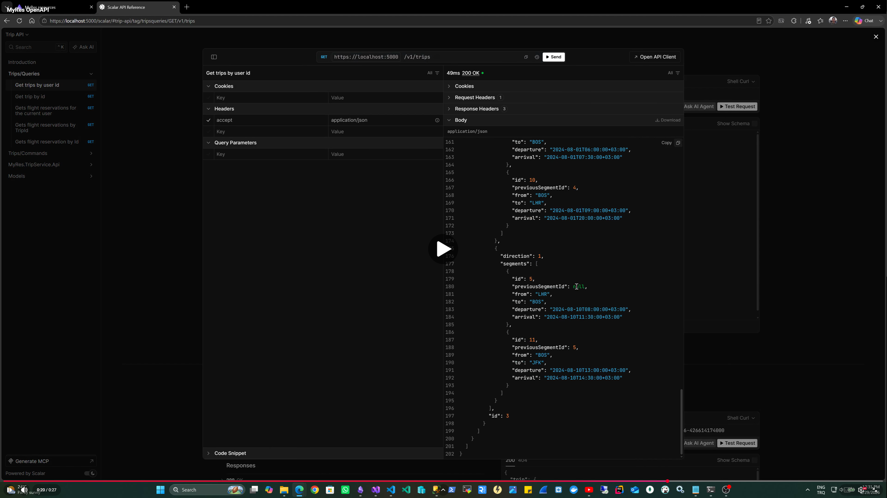
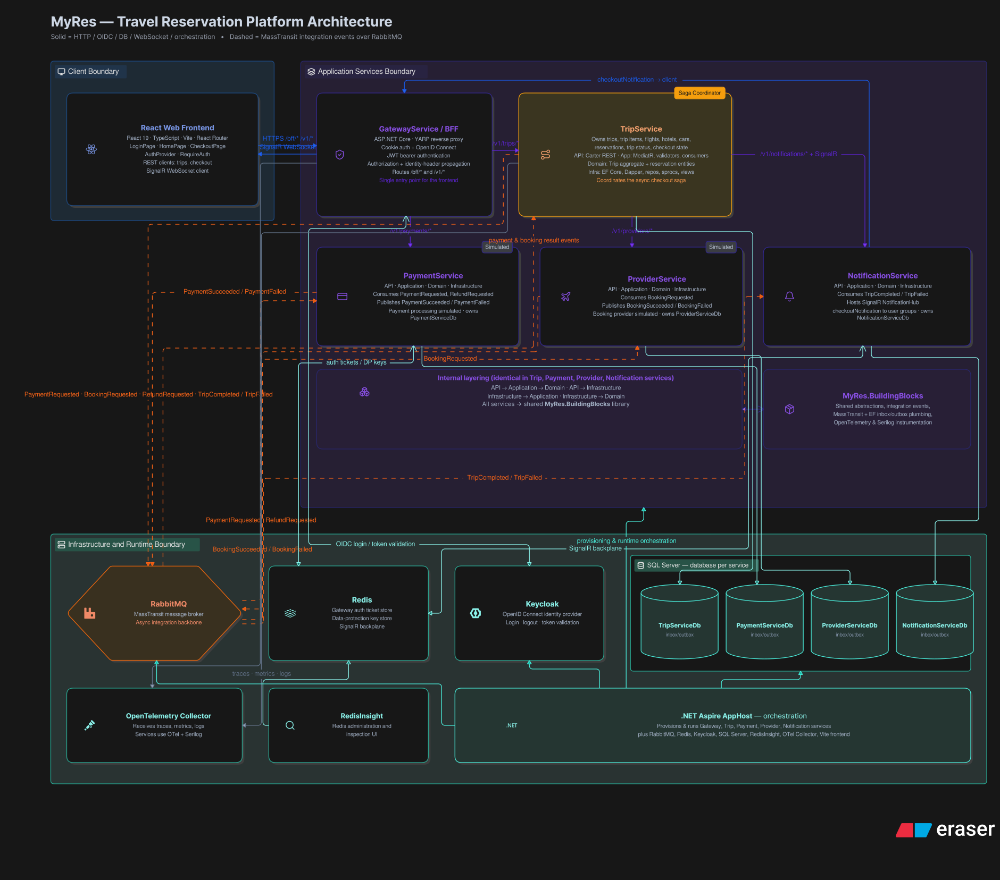
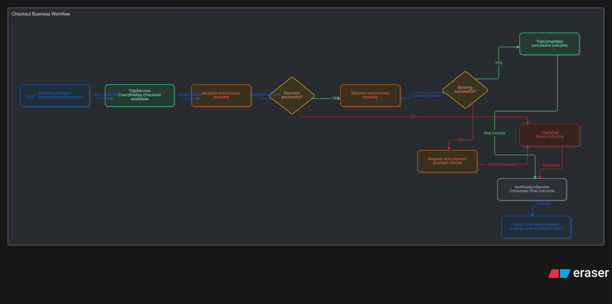
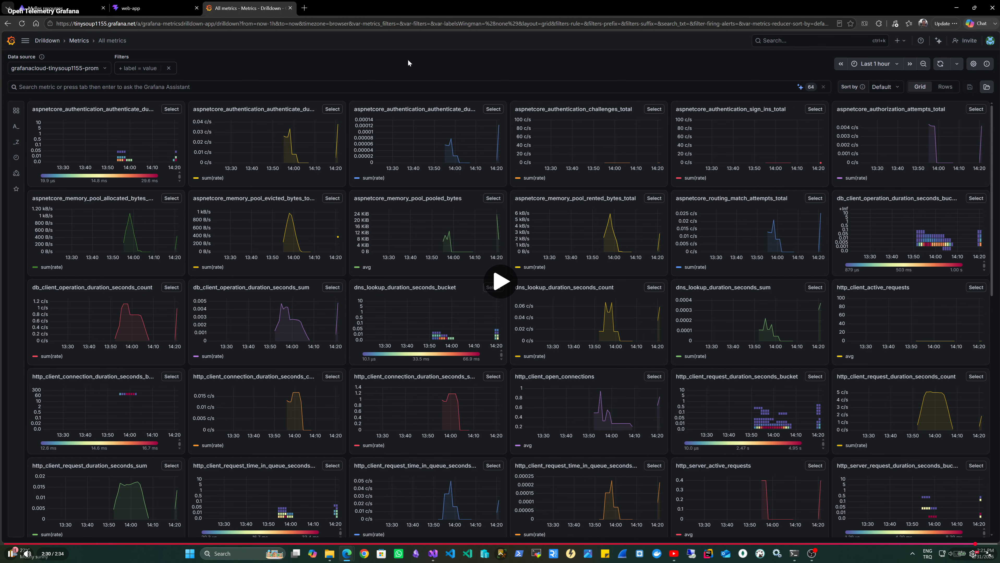
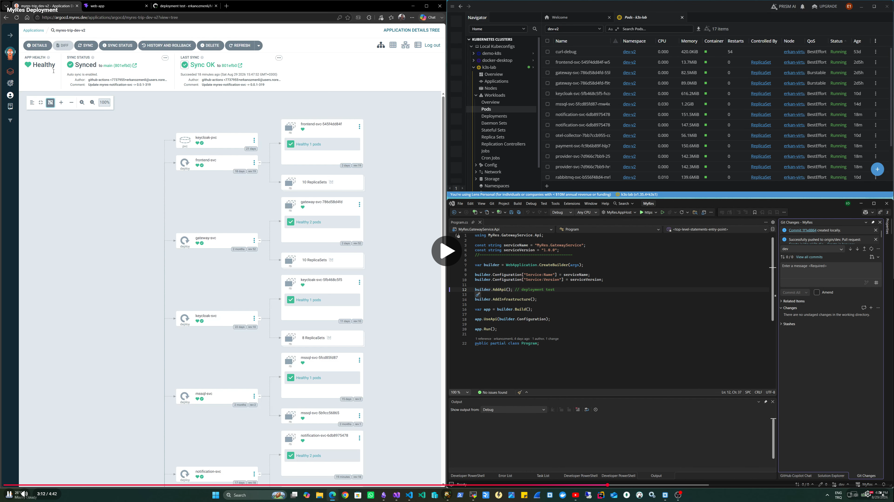

# MyRes

MyRes is a **reference implementation of a microservices-based architecture**, built with **.NET 10** and fully orchestrated with **.NET Aspire**.

> **Note:** MyRes is **not a fully fledged or production-ready reservation platform**. The reservation, payment, provider, and notification components are intentionally simplified and exist primarily to demonstrate how different distributed-system patterns and technologies can work together in an application architecture.

The project focuses on architecture and developer experience rather than implementing a complete business domain. It demonstrates a range of distributed-system patterns and technologies, including synchronous and asynchronous communication, authentication, caching, observability, real-time communication, **horizontal scalability**, and service orchestration with .NET Aspire. The microservices are designed to run as independently scalable instances in a distributed environment. Deployment follows a GitOps workflow with Kubernetes, Kustomize, Argo CD, and K3s.


## Quick Start

### Prerequisites

Make sure the following tools are installed:

- **Node.js** (for React web frontend app)
- **.NET 10 SDK**
- **Visual Studio 2026**
- **Docker Desktop**


These credentials are intended for local development and demonstration purposes only.


### Run the Application

1. Clone the repository

2. Make sure Docker Desktop is running.
    
3. Open the solution in **Visual Studio 2026**.
    
4. Set the Aspire AppHost project as the startup project.
    
5. Run the AppHost
    
.NET Aspire will provision and orchestrate the required application services and infrastructure dependencies.

Once the application starts, open the **Aspire Dashboard** to explore the running resources, service endpoints, logs, traces, and application health.


## What Is Included?

The solution contains the following main components:

- **React Web Frontend** — user-facing SPA
- **API Gateway / BFF** — single entry point for the frontend
- **Trip Service** — trip management and checkout workflow coordination
- **Payment Service** — simplified payment operations
- **Provider Service** — simplified booking/provider integration
- **Notification Service** — real-time checkout updates
- **Keycloak** — OpenID Connect identity provider
- **RabbitMQ + MassTransit** — asynchronous integration events
- **SQL Server** — service-owned persistent data
- **Redis** — gateway state and SignalR backplane
- **OpenTelemetry Collector** — traces, metrics, and logs
- **.NET Aspire AppHost** — local orchestration and service discovery


## Architecture Overview

The architecture is designed around two complementary levels:

- **Internal architecture** — Each service follows Clean Architecture for separation of concerns and dependency direction, with Vertical Slice Architecture used to organize application features around their use cases.
- **External architecture** — Services form a microservices-based system and use Saga Choreography for distributed business workflows, with synchronous HTTP communication where appropriate and asynchronous integration events through RabbitMQ and MassTransit.

The high-level architecture of MyRes is shown below:

At a high level:

- Client requests enter through the API Gateway / BFF.
- Each service encapsulates its own business logic and follows its internal architectural boundaries.
- Application services communicate through synchronous HTTP where appropriate.
- Integration events are exchanged asynchronously using RabbitMQ and MassTransit.
- Distributed workflows are coordinated through Saga Choreography.
- Authentication is handled by Keycloak.
- Services use SQL Server for persistence.
- Redis provides shared gateway state and SignalR backplane functionality.
- OpenTelemetry collects application telemetry.
- .NET Aspire orchestrates the complete local development environment.




## See It in Action

The development environment includes a preconfigured demo user:

- **Username:** `demo`
- **Password:** `demo`

The following video shows the application running through .NET Aspire, including the Aspire Dashboard and the main application components.

> **Demo video:**

[](https://youtu.be/Sa4qLgWHGwI)

This gives a quick overview of what to expect after starting the solution.

---


## Documentation

The APIs expose OpenAPI documentation and can be explored and tested interactively using Scalar. While individual services provide their own API documentation, the Gateway Service also exposes the OpenAPI documents of the downstream services through a centralized Scalar interface.

The Gateway acts as an API documentation entry point, allowing the APIs of services such as Trip Service to be discovered and tested without accessing the services directly.

The Gateway's OpenAPI routes are configured through YARP and proxy the corresponding OpenAPI documents from the downstream services. A small middleware adjusts the generated OpenAPI servers URL so that requests executed from Scalar are sent through the Gateway rather than directly to the underlying service.

Since the Gateway is also responsible for authentication, the Scalar interface is protected by Keycloak authentication. This preserves the same authenticated request flow used by the application while providing a centralized API exploration experience.

```text
Trip Service
     │
     │ OpenAPI
     ▼
   YARP
     │
     ▼
Gateway Service
     │
     ├── Keycloak Authentication
     │
     ▼
   Scalar
     │
     ▼
 API Exploration

```

> **Demo video:**

[](https://youtu.be/dFDamCqne7w)

---

# Architecture Details

The diagram below provides a detailed view of the MyRes architecture, showing the main application services, infrastructure components, communication paths, and supporting platform services.

It also illustrates how synchronous HTTP communication, asynchronous messaging, authentication, caching, real-time communication, and observability come together across the system.



The following sections briefly describe the responsibilities and key architectural decisions behind each component.


## Client & Frontend

The React frontend uses the Gateway / BFF for authentication. The browser authenticates through the OIDC Authorization Code Flow, while the authenticated session is maintained using a secure cookie.

In local development, the Vite development server proxies frontend and authentication-related routes to the Gateway. In Kubernetes, the same routing model is provided by the Ingress layer.


## API Gateway / BFF

The Gateway / BFF acts as the authentication boundary for the web application. OIDC authentication is handled by the Gateway, which establishes the browser session using a cookie. Authenticated requests are then routed to the appropriate backend service through YARP.

Backend microservices do not need to handle browser authentication directly; authentication is handled at the Gateway boundary.

```text
                    Keycloak
                        │
        ...
                        │
                    YARP Gateway
                        │
                 IRequestIdentity
                        │
                  Microservices
```

For web requests, the Gateway authenticates the user and propagates the authenticated identity to downstream services through the internal request context.


## Trip Service

The Trip Service contains the main DDD and CQRS implementation in MyRes. The domain model uses Aggregate Roots and encapsulates business operations within the domain layer.

The API layer exposes RESTful endpoints using Carter, with application commands and queries handled through MediatR. MediatR pipeline behaviors are used for cross-cutting concerns such as request validation and distributed telemetry.

Additional implementation patterns demonstrated in the service include:

SaveChangesInterceptor for automatic entity auditing.
Dapper for query scenarios where direct SQL access is appropriate.
Serilog for structured application logging.
Mapster for request/response mapping.
FluentValidation for command validation.


## Payment Service

The Payment Service is intentionally minimal and exists primarily to demonstrate asynchronous microservice communication. It consumes payment-related integration events through MassTransit and publishes the corresponding success or failure events as part of the checkout workflow.


## Provider Service

The Provider Service is similarly lightweight and focuses on demonstrating asynchronous event consumption and publishing within the distributed checkout workflow. It is intentionally simplified rather than representing a complete provider integration domain.


## Notification Service

The Notification Service currently provides real-time checkout updates to the frontend using SignalR. The service is intentionally lightweight and can be extended with additional notification channels such as email, SMS, and push notifications.

SignalR uses Redis as a backplane, allowing real-time communication to work across multiple service instances in a horizontally scaled environment.

For WebSocket-based deployments, the React client uses a direct WebSocket connection with SignalR negotiation disabled. This avoids the negotiation step and helps ensure a consistent connection path when the application is running behind a load balancer or ingress in a scaled environment.

#### React SignalR Configuration:

```tsx
skipNegotiation: true,
transport: signalR.HttpTransportType.WebSockets
```

The SignalR connection also enables automatic reconnection to improve resilience during temporary connection interruptions.


## Messaging

MyRes uses RabbitMQ with MassTransit for asynchronous communication between microservices. Integration events are used to decouple services and coordinate distributed workflows.

Transactional Outbox is used to reliably persist integration messages together with local database changes before they are published to the message broker. On the consumer side, Inbox-based message tracking is used to support idempotent message processing and protect against duplicate deliveries.

MassTransit retry policies are configured for transient failures, allowing failed message processing to be retried before the message is considered unsuccessful.

### Checkout Workflow

The following diagram illustrates the main checkout workflow and the asynchronous interactions between the participating services.



> The workflow demonstrates Saga Choreography, including failure handling and compensation. For example, a failed payment is propagated as an integration event, allowing the Trip Service to transition the workflow to a failed state and notify other interested services.

## Identity

MyRes uses **Keycloak** as its OpenID Connect identity provider.

The development environment is preconfigured with the required Keycloak realm and clients, so no manual identity-provider configuration is required to run the application.

The following clients are provisioned automatically:

- `gateway-bff` — Web authentication through OIDC Authorization Code Flow and cookie-based sessions.
- `myres-mobile` — Mobile authentication using Authorization Code Flow with PKCE and Bearer JWTs.
- `abc-customer-api` — Machine-to-machine authentication using Client Credentials and Bearer JWTs.

The web and mobile flows represent user authentication, while the client credentials flow is used for machine-to-machine communication.

```text
                    Keycloak
                        │
        ┌───────────────┼────────────────┐
        │               │                │
   gateway-bff     myres-mobile    abc-customer-api
        │               │                │
     Browser        iOS / Android    External System
        │               │                │
      Cookie       Bearer JWT       Bearer JWT
     OIDC + Code   Code + PKCE     Client Credentials

```


## Data

For local development, MyRes supports switching between a local SQL Server instance and the SQL Server container managed by .NET Aspire. The UseLocalDb setting in Aspire.Host/appsettings.Development.json controls which option is used, allowing developers to work with their existing local database or run the application entirely with the containerized database environment.

```json
"UseLocalDb": false
```

* false — Use the SQL Server container managed by .NET Aspire.
* true — Use the configured local SQL Server instance.

MyRes follows a Code First approach with Entity Framework Core and Domain-Driven Design (DDD). Database migrations and seed data are applied automatically when the application starts, making the local development environment easy to initialize.

The domain model uses Entity Framework Core's Table-per-Type (TPT) inheritance strategy where appropriate. This keeps the inheritance structure of the domain model explicit in the relational schema, with base and derived entity properties stored in their respective tables.

In addition to schema changes, database objects such as views, stored procedures, and indexes are version-controlled alongside the application code. These objects are updated through dedicated EF Core migrations, allowing database changes to follow the same versioned migration workflow as the application schema.

Database object definitions are organized under the service's Data/DesignTime/DBObjects directory and can be maintained as versioned SQL scripts. This keeps database objects reproducible and ensures that changes are applied consistently when migrations are executed.

```text
Data/
└── DesignTime/
    └── DBObjects/
        ├── Indexes/
        ├── StoredProcedures/
        │   ├── uspGetFlightReservationById_v1.sql
        │   └── uspGetFlightReservationById_v2.sql
        └── Views/
            └── vwFlight_Reservation_v1.sql

```


## Observability

MyRes uses OpenTelemetry for distributed tracing, metrics, and logs.

The application can switch between the .NET Aspire Dashboard and Grafana Cloud as the observability backend. This can be configured through the OpenTelemetry settings in Aspire.Host/appsettings.Development.json.

```json
"OpenTelemetry": {
  "UseAspire": true,
  "CollectorEndpoint": "http://localhost:4317"
}
```

Set UseAspire to true to use the Aspire Dashboard, or false to send telemetry through the configured OpenTelemetry Collector to Grafana Cloud.

This makes it easy to experiment with both local Aspire observability and an external APM platform without changing the application code.

> **Note:** To use Grafana Cloud, provide your Grafana OTLP authorization credentials in datamount/otel/config.yaml.

> **Demo video:**

[](https://youtu.be/msYMOYJfltk)

## .NET Aspire

.NET Aspire is used as the orchestration layer for the MyRes development environment. The Aspire AppHost defines the application services, infrastructure dependencies, service references, startup dependencies, and development-time configuration in one place.

The goal is to keep the distributed application experience simple during development: starting the AppHost brings together the required services and infrastructure, while the Aspire Dashboard provides a central view of resources, endpoints, logs, traces, metrics, and application health.


## Testing

MyRes uses multiple test types to validate business logic, service behavior, architectural boundaries, and database contracts.

- **Unit Tests** — Test domain behavior and application commands/queries in isolation. Domain tests focus on business rules without mocking, while application tests use mocks where dependencies need to be isolated.
- **Integration Tests** — Validate API behavior against a real application environment and database. Tests can run against either a local SQL Server instance or an isolated SQL Server container using Testcontainers.
- **Contract Tests** — Verify the contract between the application and database objects such as views and stored procedures, including Dapper result mappings. These tests can also switch between a local database and a containerized database.
- **Architecture Tests** — Enforce architectural boundaries both across microservices and within the Trip Service layers. For example, services are prevented from depending directly on other services, while the Domain layer is protected from dependencies on Infrastructure, API, and Entity Framework.

Tests use xUnit and FluentAssertions, with Moq used where mocking is appropriate.

### CI Test Execution

Unit and Architecture tests are executed as part of the GitHub Actions CI workflow. Integration tests are scheduled to run weekly, providing additional validation against a real application and database environment.

The PlaygroundTests project is intentionally kept outside the CI pipeline and is used for temporary or exploratory tests during development.


## Deployment & GitOps

### Overview 

```text
                 Application Repository
                         │
                    GitHub Actions
                         │
              ┌──────────┴──────────┐
              │                     │
         Build & Test          Docker Image
                                    │
                              Docker Hub
                                    │
                                    ▼
                           GitOps Repository
                                    │
                          Kustomize / yq
                         ┌──────────┴──────────┐
                         │                     │
                       dev                  master
                         │                     │
                         └──────────┬──────────┘
                                    │
                                  Argo CD
                                    │
                                    ▼
                                   K3s

```

### Ingress & External Routing

The Kubernetes deployment uses Traefik Ingress as the external entry point for the application. TLS is configured for the application domains, while host and path-based routing directs incoming traffic to the appropriate internal services.

```text
myres.dev
├── /        → Frontend
├── /v1      → Gateway / BFF
├── /bff     → Gateway / BFF
└── OIDC callbacks → Gateway / BFF

api.myres.dev
└── /        → Gateway / BFF

auth.myres.dev
└── /        → Keycloak
```

This keeps the frontend, API/BFF, and identity provider accessible through well-defined external endpoints while the underlying services remain exposed through internal Kubernetes ClusterIP services.

### CI/CD Pipeline 

The project uses GitHub Actions for continuous integration and delivery. The pipeline is triggered by pushes to the dev and master branches.

A dynamic build matrix is generated from .github/services.json. Before building, the pipeline analyzes the files changed in the current commit and selects only the affected services and frontend application. If a shared project under BuildingBlocks changes, the matrix automatically includes all services.

The pipeline performs the following steps:

1. Change Detection — Determines which services are affected by the current commit and generates the build matrix dynamically.
2. Testing — Runs the relevant Domain Unit Tests, Application Unit Tests, and Architecture Tests as part of CI.
3. Versioning — Uses GitVersion to generate semantic versions and associates images with the current commit SHA.
4. Container Build & Push — Builds the selected services and frontend as Docker images and pushes them to Docker Hub.
5. GitOps Update — Updates the corresponding image tag in the separate GitOps repository using yq and commits the change.
The dev branch targets the development environment, while master targets the production environment. This keeps application source code, container images, and deployment configuration separated while allowing the deployment process to be driven entirely through Git changes.

The overall flow is:

```text
Push to dev / master
        │
        ▼
 Change Detection
        │
        ▼
 Dynamic Build Matrix
        │
        ├── Unit Tests
        ├── Architecture Tests
        │
        ▼
 GitVersion
        │
        ▼
 Docker Build & Push
        │
        ▼
 GitOps Repository
        │
   Update image tag
        │
        ▼
    Argo CD
```


> **Production Note**  
> The current pipeline updates the GitOps repository directly from parallel matrix jobs. When multiple services are built simultaneously, concurrent commits to the GitOps repository may result in race conditions.  
>  
> For production environments, it is strongly recommended to separate **CI and CD** responsibilities. CI should build, test, and publish immutable container images, while a dedicated CD process should be responsible for updating and deploying the corresponding GitOps manifests. This avoids concurrent GitOps updates and provides a more controlled deployment flow.


### Container Images 

Each deployable service and the React frontend is built as an independent Docker image and published to Docker Hub.

Image versions are generated using GitVersion, providing branch-aware semantic versioning. The dev and master branches produce different version formats, for example:

```text
dev     → 0.1.0-alpha.309
master  → 0.0.1-309
```

Images are published with both the generated semantic version and the commit SHA:

```text
erkanozmenli/myres-trip-svc:0.1.0-alpha.309
erkanozmenli/myres-trip-svc:sha-abc1234
```

The GitOps repository references the versioned image tag in its environment-specific Kustomize overlays. This keeps deployments tied to an explicit application version rather than a mutable tag such as latest.

The CI pipeline also uses a dynamic build matrix. Only services affected by a change are selected for building; changes under shared BuildingBlocks trigger all deployable services.


### GitOps Repository 

https://github.com/erkanozmenli/MyRes-Gitops

Deployment manifests are maintained in a separate Git repository, MyRes-GitOps, keeping application source code and infrastructure/deployment configuration separated.

The repository follows a Kustomize-based structure with a shared base and environment-specific configurations:

```text
MyRes-GitOps
└── gitops-v2
    ├── base
    │   ├── frontend
    │   ├── gateway
    │   ├── trip
    │   ├── payment
    │   ├── provider
    │   ├── notification
    │   ├── rabbitmq
    │   ├── redis
    │   ├── mssql
    │   ├── keycloak
    │   └── otel-collector
    │
    └── environments
        ├── dev
        │   └── ...
        └── prod
            └── ...

```

The base directory contains the common Kubernetes resources, while dev and prod provide environment-specific overlays.

The application CI pipeline updates the appropriate deployment manifest in this repository with the newly built image version. This makes the GitOps repository the source of truth for the desired state of the deployed application.

Deployment is then handled separately by Argo CD, which observes the GitOps repository and reconciles the Kubernetes cluster with the declared state.


### Kustomize Environments 

Kubernetes manifests are organized using Kustomize's base/overlay structure. Common resources are defined under base, while environment-specific configurations are maintained under environments/dev and environments/prod.

The base manifests contain the common Kubernetes resources for each component, such as Deployment and Service definitions. Environment overlays compose these resources and apply environment-specific patches, including container image versions and configuration.

For example:

```text
base/
└── trip/
    ├── deployment.yaml
    ├── service.yaml
    └── kustomization.yaml

environments/
├── dev/
│   ├── trip/
│   │   └── deployment-patch.yaml
│   └── kustomization.yaml
└── prod/
    ├── trip/
    │   └── deployment-patch.yaml
    └── kustomization.yaml
```

The dev and prod environments currently contain the same configuration structure and values. This is intentional: the production overlay provides a separate place where environment-specific requirements can be introduced without modifying the shared base manifests.

> **Production Note**
The current prod configuration is intentionally aligned with dev and should not be interpreted as a production-hardened configuration. In a real deployment, the prod overlay should be adjusted according to production requirements, including environment-specific configuration, secrets, resource limits, scaling policies, security settings, and other operational concerns.

### Horizontal Scaling & Rolling Updates

Deployments also include graceful termination settings to support rolling updates with minimal or zero downtime. The preStop lifecycle hook and termination grace period give existing requests time to complete before a pod is terminated.

The Gateway additionally demonstrates Horizontal Pod Autoscaling (HPA), allowing the number of replicas to scale based on CPU utilization:

```text
Gateway
  │
  ├── min replicas: 2
  ├── max replicas: 10
  └── CPU target: 70%
```

#### HPA Testing

For those who want to experiment with the Gateway HPA in a Kubernetes environment, the project includes an optional CPU-load endpoint. When enabled, the endpoint intentionally consumes CPU for a short period, making it possible to observe the HPA scaling behavior.

```csharp
app.MapGet("/cpu-burn", () =>
{
    var end = DateTime.UtcNow.AddSeconds(30);

    while (DateTime.UtcNow < end)
    {
        double x = 0;
        for (int i = 0; i < 1_000_000; i++)
            x += Math.Sqrt(i);
    }

    return Results.Ok("done");
})
.WithTags("CPU Burn");
```

### Argo CD

Argo CD is used as the GitOps deployment and reconciliation tool for the Kubernetes environment.

The desired state of the MyRes dev environment is defined in the MyRes-GitOps repository. Argo CD continuously monitors the relevant manifests and reconciles the Kubernetes cluster with the state declared in Git.

The deployment flow is therefore:

```text
Application Repository
        │
        ▼
   GitHub Actions
        │
        ├── Build & Test
        ├── Docker Image
        │      │
        │      ▼
        │   Docker Hub
        │
        └── Update GitOps Repository
                    │
                    ▼
              MyRes-GitOps
                    │
                    ▼
                 Argo CD
                    │
                    ▼
                  K3s
```

For the current implementation, Argo CD deployment is configured for the dev environment. The master/production deployment is not yet configured.

> **Note:** The production Argo CD configuration is intentionally left as a future extension. The GitOps repository already provides a separate prod environment structure, allowing a production Argo CD Application and its corresponding policies to be introduced independently.

#### Deployment Demo

A short demo video demonstrates the GitOps deployment flow from updating the application image version to Argo CD detecting the Git change and synchronizing the Kubernetes resources.

> **Demo video:**

[](https://youtu.be/96pe4ObdYD8)
